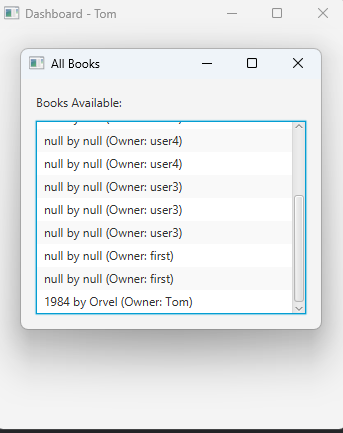
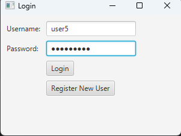
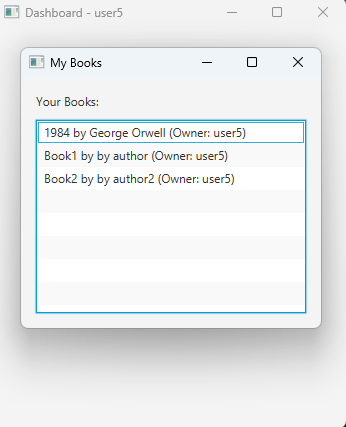

Register New Users
Users can register by clicking the "Register New User" button on the login screen.
Default role for new users is USER.
User Dashboard
   View the list of books.
   Add books to the library inventory.
   Added books are persistent and won't be lost after restarting the application.
   Endpoints
   Authentication
   HTTP Method	Endpoint	Description
   POST	/api/auth/login	Login a user
   POST	/api/auth/register	Register a new user
   Books
   HTTP Method	Endpoint	Description
   GET	/api/books	View all books
   POST	/api/books/add	Add a new book
   Example Workflow
   Start the application and log in as the user (user/qwerty123).
   Add new books using the Add Book button.
   Register new users via the Register New User button.
   Log in as a registered user and view the available books.
   Books added by users or admins are stored persistently.
img.png](img.png)